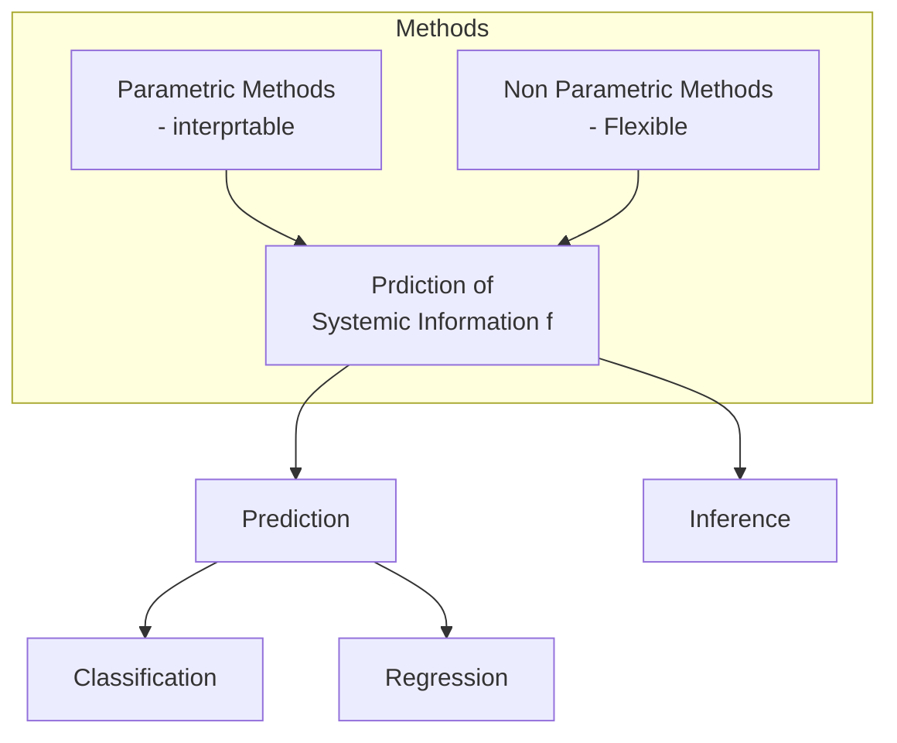

# Why Estimate F

## Prediction
- The accuracy of ˆ Y as a prediction for Y depends on two quantities,
which we will call the reducible error and the irreducible error.
$$
E(Y - \hat{Y})^2 = E\big[f(X) + \epsilon - \hat{f}(X)\big]^2 \\
= \big[f(X) - \hat{f}(X)\big]^2 \, \text{(Reducible)} \, + \text{Var}(\epsilon) \, \text{(Irreducible)}.
$$

## Inference
- We are often interested in understanding the association between Y and X1, . . . ,Xp. In this situation we wish to estimate f, but our goal is not necessarily to make predictions for Y . Now ˆ f cannot be treated as a black box
- ### 3 Questions
- Which predictors are associated with the response?
- What is the relationship between the response and each predictor?
- Can the relationship between Y and each predictor be adequately summarized using a linear equation, or is the relationship more complicated?
# How to Estimate F: Parametric vs Non Parametric Methods

